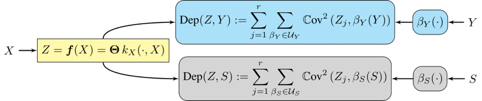
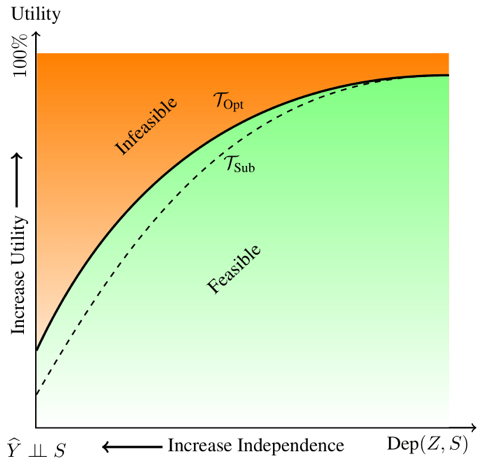
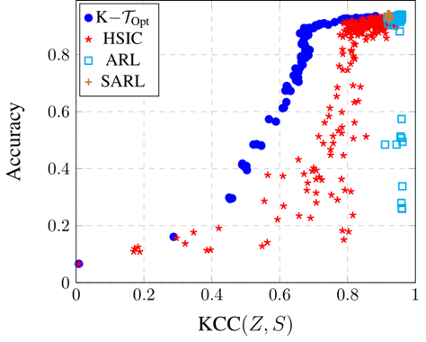
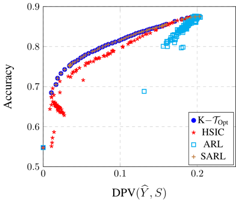
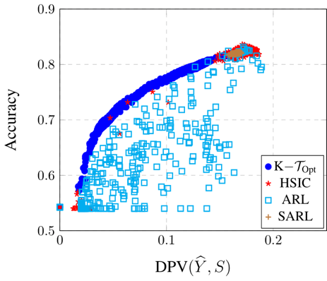
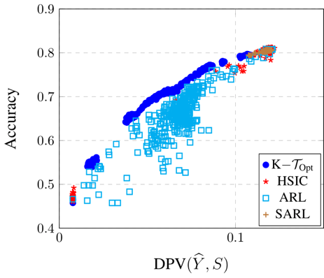
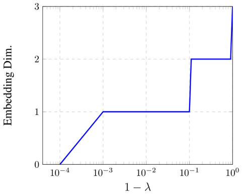
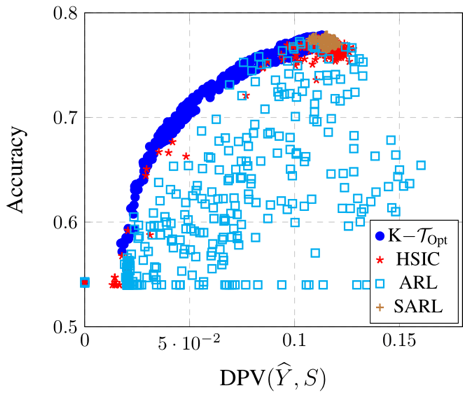
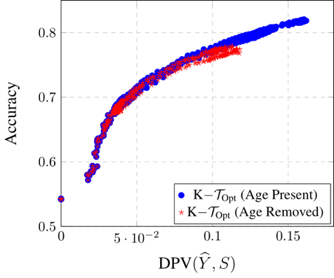

# On Characterizing the Trade-off in Invariant Representation Learning

By [Bashir Sadeghi](https://www.egr.msu.edu/~sadeghib/), [Sepehr Dehdashtian](https://sepehr-dehdashtian.jimdosite.com/),
and [Vishnu Naresh Boddeti](https://hal.cse.msu.edu/)


### Introduction



This code archive includes the Python implementation of "On Characterizing the Trade-off in Invariant Representation
Learning" and corresponding baseline methods. We model the encoder via `r` functions in a universal reproducing kernel
Hilbert spaces, where `r` is the embedding dimensionality. Denoted by K-T-Opt, our method aims to maximize the
dependency between the representation `Z` and the target attribute `Y` while keeping the dependency between `Z` and the
semantic attribute S as small as possible. Suppose the statistical dependence between `Y` and `S` is not negligible.
In that case, there will be a trade-off between the utility of the downstream target task and invariance to `S`,
as shown in the following diagram.


### Citation

If you think this work is useful to your research, please cite:

    @inproceedings{sadeghi2022tradeoff,
      title={On Characterizing the Trade-off in Invariant Representation Learning},
      author={Sadeghi, Bashir and Dehdashtian, Sepehr and Boddeti, Vishnu},
      booktitle={Transactions on Machine Learning Research},
      year={2022}
    }

**Link** to the paper: https://hal.cse.msu.edu/papers/characterizing-trade-off-invariant-representation-learning/

### Setup

First, clone the repository by calling the following command:
~~~~
git clone https://github.com/human-analysis/tradeoff-invariant-representation-learning.git
~~~~
Download data (about 1GB) used in the paper:

```
cd tradeoff-invariant-representation-learning
wget http://hal.cse.msu.edu/assets/data/papers/2022-tmlr-tradeoff-invariant-representation-learning.zip
unzip 2022-tmlr-tradeoff-invariant-representation-learning.zip
rm -rf 2022-tmlr-tradeoff-invariant-representation-learning.zip
```

### Requirements

1. `python 3.8.5`
2. `pyTorch 1.10.0`
3. `pytorch-lightning 1.4.5`
4. `wget`
5. Check `requirements.yml` for detailed dependencies. To install the dependencies completely in a new conda
  environment, you can run `conda env create -f requirements.yml` command. 

### Commands to Reproduce Results in Paper

Set the trade-off parameter `tau` between zero and one, where `tau` equal to zero correspond to standard representation
learning with  no invariance constraint and `tau` approaching one corresponds to exact invariance. In the the following
commands we let `tau=0.5`.

#### Toy Gaussian Dataset



###### Our K-T_Opt approach
~~~~
python main_gaussian.py --args exps/gaussian/args_gaussian_kernel.txt --tau=0.5
~~~~

###### SARL baseline
~~~~
python main_gaussian.py --args exps/gaussian/args_gaussian_linear.txt --tau=0.5
~~~~

###### ARL baseline
~~~~
python main_gaussian.py --args exps/gaussian/args_gaussian_arl.txt --tau=0.5
~~~~

###### HSIC-IRepL baseline
~~~~
python main_gaussian.py --args exps/gaussian/args_gaussian_hsic.txt --tau=0.5
~~~~

#### CelebA Dataset 


###### Our K-T_Opt approach
~~~~
python main.py --args exps/celeba/args_celeba_kernel.txt --tau=0.5
~~~~

###### SARL baseline
~~~~
python main.py --args exps/celeba/args_celeba_linear.txt --tau=0.5
~~~~

###### ARL baseleine
~~~~
python main.py --args exps/celeba/args_celeba_arl.txt --tau=0.5
~~~~

###### HSIC-IRepL baseleine
~~~~
python main.py --args exps/celeba/args_celeba_hsic.txt --tau=0.5
~~~~

#### 2018-WA Census Data


###### Our K-T_Opt approach
~~~~
python main_withdataloader.py --args exps/folktables/args_folk_kernel.txt --tau=0.5
~~~~

###### SARL baseline
~~~~
python main_withdataloader.py --args exps/folktables/args_folk_linear.txt --tau=0.5
~~~~

###### ARL baseleine
~~~~
python main.py --args exps/folktables/args_folk_arl.txt --tau=0.5
~~~~

###### HSIC-IRepL baseleine
~~~~
python main.py --args exps/folktables/args_folk_hsic.txt --tau=0.5
~~~~

#### 2018-NY Census Data


###### Our K-T_Opt approach
~~~~
python main_withdataloader.py --args exps/folktables-4class/args_folk4c_kernel.txt --tau=0.5
~~~~

###### SARL baseline
~~~~
python main_withdataloader.py --args exps/folktables-4class/args_folk4c_linear.txt --tau=0.5
~~~~

###### ARL baseleine
~~~~
python main.py --args exps/folktables-4class/args_folk4c_arl.txt --tau=0.5
~~~~

###### HSIC-IRepL baseleine
~~~~
python main.py --args exps/folktables-4class/args_folk4c_hsic.txt --tau=0.5
~~~~

### Effect of Semantic Attribute (Age) Removal on 2018-WA Census Dataset
 
